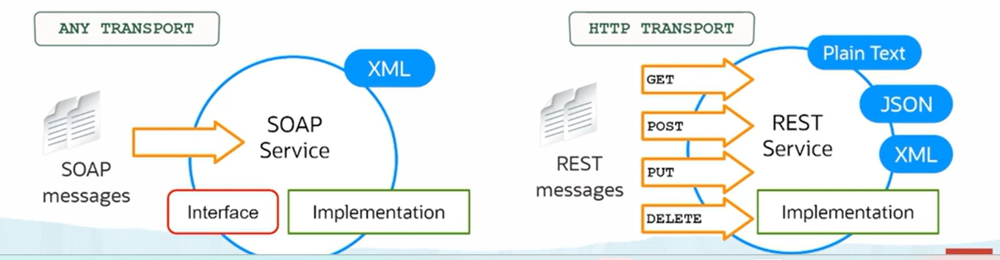
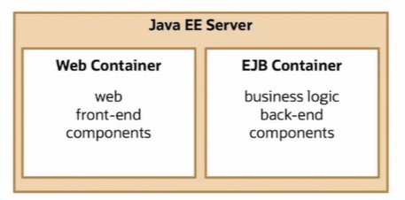
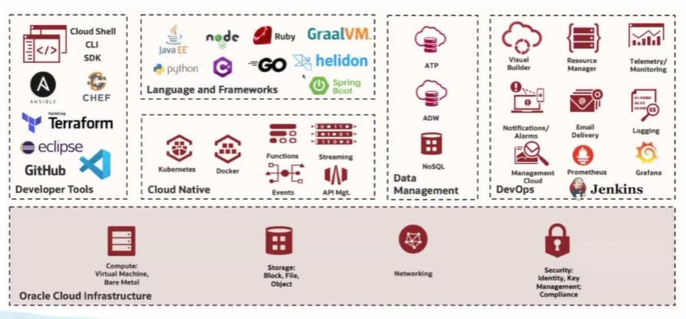

# Explain the Use of Java in the Enterprise

[Previous](NoteD.md)

## **Implement Web Services with Java**

- Expose code to the enterprise for reuse in a controlled, standardized manner.
- JAXB and JAXP APIs enable XML object mapping, marshaling, and unmarshalling.
- JSONP API enables JSON Object mappings, marshaling, and unmarshalling.
- JAX-WS API enables SOAP Service implementation.
- JAX-RS API enables REST Service implementation.

## **Enterprise Java**

Java EE applications are actually deployed to a server in order to execute. While Java Standard Edition applications can run from the command line, Java EE applications have to be deployed to a server like WebLogic or WebSphere, JBoss, or Tomcat.

### Java EE Application Server (WebLogic)

- Hosts Java EE Applications.
- Provides Enterprise Java Bean (EJB) and Web Containers.
- Provides Security, Concurrency, Transaction Management and so on.

### Java in Oracle Cloud

The Oracle Cloud Infrastructure, OCI, supports a number of different APIs and services to make enterprise applications easier to write for the cloud.

[Back to Top](#explain-the-use-of-java-in-the-enterprise)
