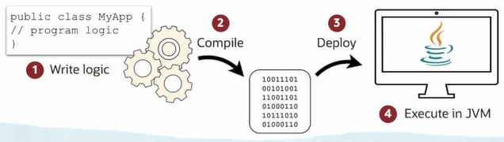

# Explain Java Origins and Ecosystem

[Previous](README.md) | [Next](Part2.md)

## **Java Origin and Evolution**

- A member of C-like family of programming languages.
- Originally designed to consumer electronics.
- Widely adopted across billlions of devices, ranging from smart cards to supercomputers.

## **Java Ecosystem**

- [Java Card](#java-card)

- [Java ME Micro-Edition](#java-me-micro-edition)

- [Java SE Standard-Edition](#java-se-standard-edition)

- [Java MP Micro-Profile](#java-mp-micro-profile)

- [Java EE Enterprise-Edition](#java-ee-enterprise-edition)

### Java Card

Which is the smart card addition and can be used with SIM cards.

### Java ME Micro-Edition

Which can work with things like smart TVs, set-top boxes and embedded devices.

### Java SE Standard-Edition

Where you start learning the Java programming language, because it contains both the tools, like compilers, Java virtual machines to run your code, but also the structures necessary to support the code that you're creating, libraries of very useful classes and functionality.

### Java MP Micro-Profile

It is used with micro services and allows you to define, for a server, how your application should be deployed and run as a microservice.

### Java EE Enterprise-Edition

It supports creating applications for the enterprise, this includes web services, passing messages trough Java messaging asynchronously, and enterprise JavaBeans for sharing code.

Also, for user interface, you can also create servlets, Java server pages, and Java server faces application, although seeing that being used less and less.

Mostly, we're seeing Java used in the enterprise, in what we call the back end of the enterprise, to create reusable, shareable code that can be used by many different applications.This can take the for of web services and is typically how we see Java being used today.

## **Java is Cross-Platform**

1. Each Java Program only needs to be written and compiled once.

2. No platform-spesific changes has to be applied to the source-code.

3. A single, compiled version of a program can run on any platform.

4. Java Programs are executed within a Java Virtual Machine (JVM)

[Back to Top](#explain-java-origins-and-ecosystem)
