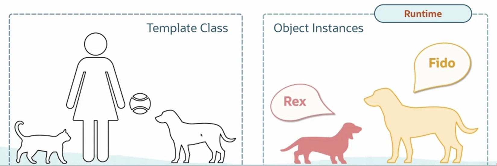
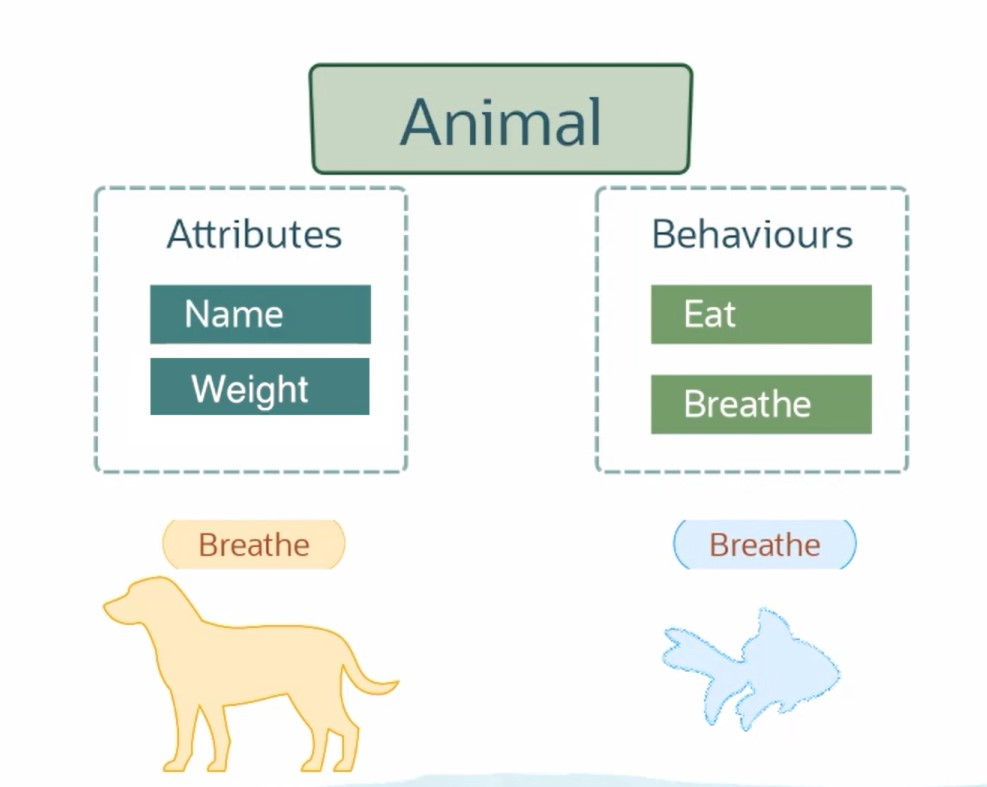
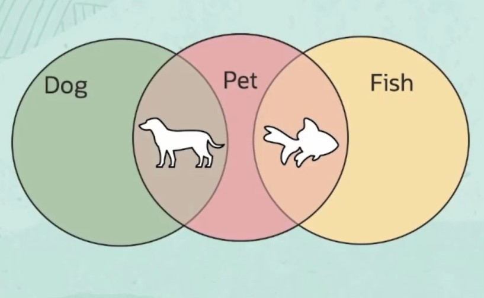
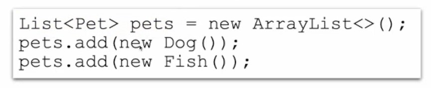
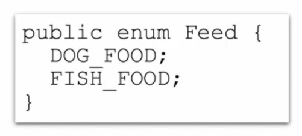
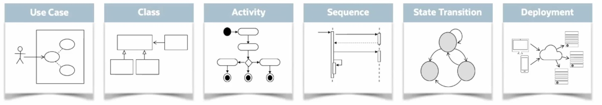

# Explore Java Design Mindset

[Previous](Part2.md) | [Next](Part4.md)

## **Classes and Objects**

- A class represents a type of thing or a concept.
- An object is an instance - a spesific example of a class.

## **Reusing Code Through Inheritance**

- Reuse (inherit) attributes and behaviours across the class hierarchy.
- Top-level classes contain generic code reused by their descendants.

## **Achieve Flexible Design**

### Interfaces

Abstract out common behavior across classes.

### Enumerations

For creating user-defined constants.

### Generic

To pass specific type information to the compiler, making programs more stable and less error-prone.

## **Analysis, Design, and Architecture**

Use unified Modelling Language (UML) to:

- Analyze business requirements.
- Model code strutures.
- Decribe application deployment.

### Use case diagram

Describes the interaction between an end user and the system.

### Class diagram

Represent the differenct classes we're going to need, and also document their behaviours, attributes, and relationships to each other.

### Activity diagram

To describe flow of control.

### Sequence diagram

To show how one object can invoke another object, and the passing of data back and forth.

### State transition diagram

To document that a certaion object goes in or out of a certain state, for example, turning on or turning something off.

### Deployment Diagram

How the application can be deployed.

[Back to Top](#explore-java-design-mindset)
