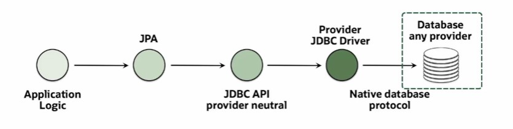

# Describe Common Java APIs

[Previous](Part3.md) | [Next](Part5.md)

## **Java Arrays and Collections**

### Array

- An array is a simple group of elements that are indexed, and is one of the easiest data structures to work with.

- Each element in the array has a different index, index of 0, 1, 2, 3, and we can easily access and manipulate the array.

### Collection API

- The Collection API provides more flexible capabilities for managing groups of elements.
- There is a collection API that is provided that allows us to work with different types of collections: **ArrayList, LinkedList, Set, Stack, and Queue**

- we can do things like **add, update, remove, search, and rearrange**. So the collection API is very useful for allowing us to manipulate collections of objects.

## **Java Streams APIs**

- They effiently filter, map, and reduce large streams of data.
- They perform actions upon data using lambda expressions.
- Lambda expressions are a form of functional programming

Example:

```java
List<Employee> employees = new ArrayList<>();
employees.stream().parallel().filter(e->e.getSalary()>1000).forEach(e->e.calculateBonus());
```

## **Java IO API**

- Transfer data through a series of interconnected streams.
- Read information from various sources input direction.
- Write information to various destinations output direction.

Example:

```java
Path file = Path.of("../employee.txt");
Files.lines(readme, Charset.forname("UTF-8")).forEach(line->system.out.println(line));
```

## **Java Concurrency API**

- Takes advantage of multi-CPU-core architecture.
- Executes code concurrently to achieve better performance and user experience.

Example:

```java
Callable<BigDecimal> taxCalculation = new Callable<>(){
    public BigDecimal call() throw Exception{
        /* perform concurrent calculations */
        return tax;
    }
};
```

## **Java Persistence API**

- Java Database Connectivity protocol (JDBC) enables database connectivity and SQL statement execution.
- Java Persistence API (JPA) enables Java object-relational mappings.



[Back to Top](#describe-common-java-apis)
