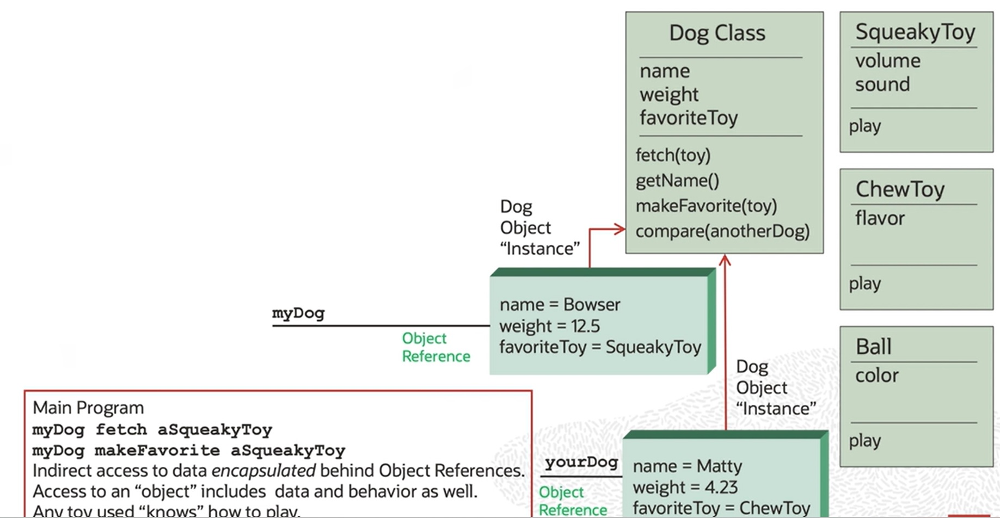

# Define an Object, Class, Attribute, Method, and Message

[Previous](README.md) | [Next](Part2.md)

## Object Oriented Sample



## Objects and Classes

What do these objects have in common?

- They are all types of dog objects.
- They have the same attributes (name, weight, favoriteToy).

```txt
name = Bowser
weight = 12.2
favoriteToy = squeakyToy
```

```txt
name = Matty
weight = 4.23
favoriteToy = chewToy
```

- They have the same behaviour. They can all tell you their name, compare one dog with another, and make a certain toy their favorite.

We use a **Class** to specify the design of our objects. An Object is a **specific instance** of a Class at run time.

Examples:

- Table and row
- Recipe and meal
- Blueprint and building
- Integer and 23

### What is an Object?

- At run time, an object is created in memory.
- Memory is allocated for its attributes.
- Each object has a unique **object reference**, a pointer to that object in memory.
- Each object has a pointer to its class definition.

### What is a Class?

It is a template (factory) for creating new objects:

- The name of the class.
- Attributes and their types.
- Messages they understand, their argurments, return types, and the code to implement them.

```txt
Dog Class
------------------
name: String
weight: Number
favoriteToy: Toy
------------------
getName: String
makeFavorite(toy)
```

[Back to Top](#define-an-object-class-attribute-method-and-message)
