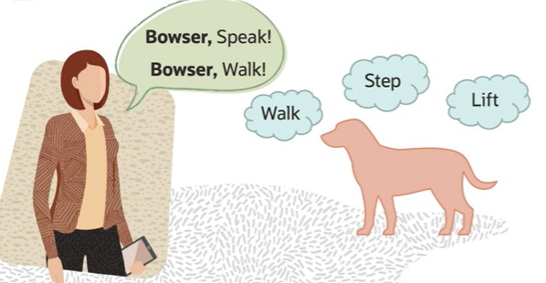
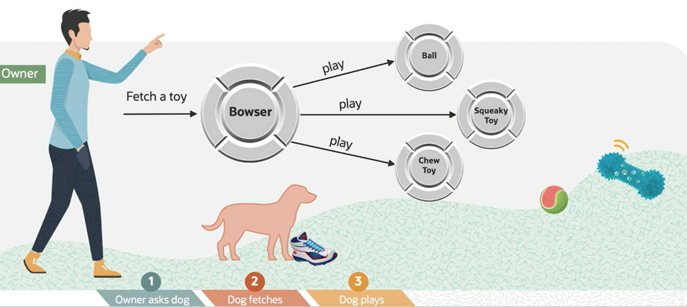
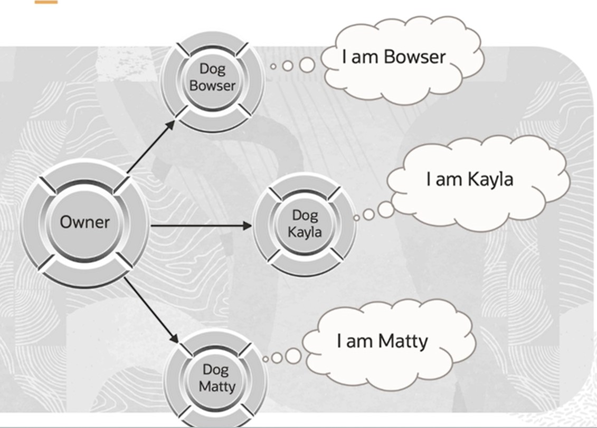

# Define an Object, Class, Attribute, Method, and Message

[Previous](README.md) | [Next](Part2.md)

## Using Object-Orientation

### Benefits

- Easier to maintain.
- Easier to enhance and extend.
- Single Place of coding.
- Minimizes side effects.
- Mimics real life, so developers can leverage their knowledge.

### Considerations and Potential Downsides

- Have to code more initially - not really a benefit on new development - more benefit in maintenance.
- More verbose.
- Memory allocation, garbage collection, slight performance impact over compiled code.

## What is This OO Stuff, Anyway?

- OO is about simulating the real world in a computer.
- In the real world, we interact with objects every day without thinking about how they work or why.
- We tell someone or something to do something and it does it (mostly).
- Objects are responsible for doing things.
- Objects collaborate with other objects to perform tasks.
- Object use their internal state to carry out the behavior.

### Example

#### What Dogs Can Do and Know

- **Behaviours**: eat, sleep, speak, chase cars, walk, fetch (toy)
- **Internal state**: name, weight, bones count, favorite toy, owner, date last meal

Dogs, like all things, have **behavior** and know about their **internal state**.

#### How We Interact with Dogs

We send a message to a thing and Ask it to do something.
Neither do we know how it does what we ask, nor do we-**as users of that thing**-care.



#### Problem Domain: Have a Dog Fetch and Play with a Toy

The owner asks the dog to fetch the toy, After the dog has fetched the toy, the dog plays with the toy.



This scenario is called a **Use Case**. It is where object-orientation starts.

A Use Case describes the object that will be used to create the application.

It also describes that **messages (behaviour)** an object understands. What things do you typically work with in this use case?.

#### Object we work with in the Dog **Domain**

- Dogs
- Owners
- Dog toys

#### Dog as an Object, What does the Dog **Know**

- Each object knows its name and other internal information.
- But since each object is different (has its own data/state), the values of the name may be different for each dog object.
- The antrhopomorphic use of **Know** is intentional, since objects mimic real-world things.



#### The Dog Object in Use

Different Use Case:

- Application 1: Dog fetches a toy.
- Application 2: Dog eats at regular intervals.
- Application 3: Dog walks a specified distance.

#### From The Dog Designer's View

The designer must use variables (other objects) to represent the dog object's state:

```txt
String name = "Bowser", Number weight = 52.5, Toy favoriteToy = a SqueakyToy
```

What happens if we decide to change the implementation and use a different variable name or way to represent the value for name? Or read it from a database or web service?

- If the implementation (data structure and algorithm) is visible to the user of the object, every place that referred to the dog's name variable would have to be changed, recompiled, and debugged.
- If the implementation (data structure and algorithm) is hidden from the user and if the implementation changes, the user of the object is not impacted.

[Back to Top](#define-an-object-class-attribute-method-and-message)
