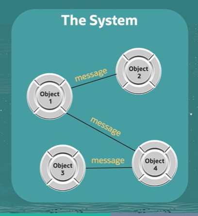

# C - Practical Object-Oriented Concepts: Part 1

## Objectives

- Define an Object, Class, Attribute, Method, and Message.
- Explain What It Means to Create an Object-oriented Application.

## Computing in the Late 1960-1970s

- Mainframes, command-line, text-based
- Punched cards
- COBOL
- Fortran
- Assembler
- ALGOL, Pascal, C/Unix
- Little/no discipline or structre
- No OO

## Smalltalk

- First "real" OO language invented by Alan Kay, Adele Goldberg and others at Xerox Palo Alto Research Center (PARC) in the early 1970s.

- Reaction to command-line, text-based, centralized, monolithic mainframe mentality of the time.

- Designed to mimic Kay's biological model of individual entities, or "cells," communicationg with each other via messages

- System was easily extendible, with a simple syntax, a self-contained development envirionment, and objects, which more closely resembled the real-world things being simulated

## Alan Kay's Vision

"I thought of objects being like biological cells and/or individual computers on a network, only able to communicate with messages.

So messaging came at the very beginning.

It took a while to see how to do messaging in a programming language efficiently enough to be useful."

