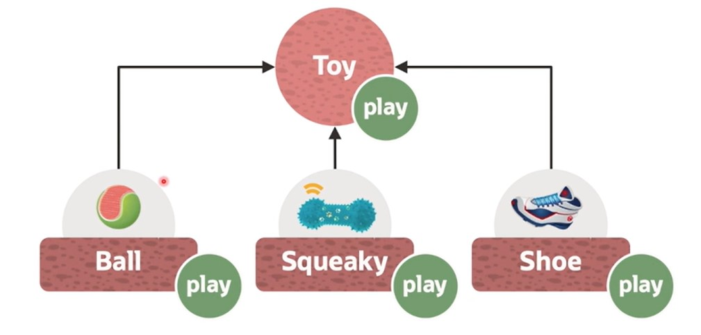

# Inheritance

[Previous](Part1.md) | [Next](Part3.md)

Inheritance means that we have different types of objects and they can inherit or gain or reuse data and behavior from a higher level, more general class.

Example:

What if you had several types of Toys:



- **Ball** - has color and bounces.
- **Squeaky** - has sound.
- **Shoe** - hase smell.

Imagine you could share the play behaviour from the more general Toy. Each type of Toy could implement play differently.

```txt
With object, you can give the same name to services that may work differently in different objects but perform the same basic function
```

[Back to Top](#inheritance)
