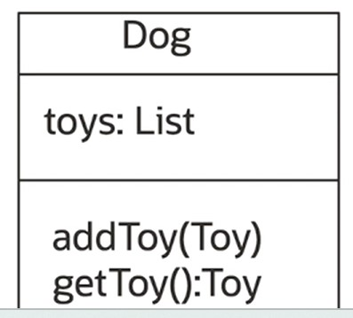

# Polymorphism

[Previous](Part3.md) | [Next](Part5.md)

In Procedural Languages, It doesn't use polymorphism, it is like:

```txt
IF (favorite is a Ball) call playBall
    ElSE (favoriteToy is a Squeaky) call playSqueaky
        ELSE (favoriteToy is a Shoe) call playShoe
```

In Object-oriented, It moves IF..ELSE to the runtime Virtual Machine:

After passing a toy - the next method play produces a different behaviour in the toy.

```java
fetch(Toy toy){
    toy.play();
    toy.makeFavorite(toy);
}
```

- At run time, the system asks toy "What type of object are you?".
- Based on what toy answerm the appropriate play behaviour is executed.
- This ability is called polymorphism.

```txt
Late Binding or Dynamic Binding, is computer programming mechanism in which the method being called upon an object or the function being called with artguments is looked up by name at run time. - Wikipedia
```

## Polymorphic Collections

A Dog has a collection of Toy objects:

```java
myDog.addToy(new Ball());
myDog.addToy(new ChewToy());
myDog.addToy(new Squeak());
```

**myDog.getLastToy().play()** - Returns the last toy object and the correct play behavior is executed depending on the type of the toy object.


