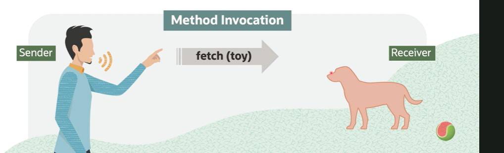

# D - Practical Object-Oriented Concepts: Part 2

## Objectives

- [Define how abstraction identifies important aspects of the domain.](Part1.md)
- Describe how inheritance supports code reuse.
- [Define what encapsulation and data hiding mean to an OOP developer.](Part3.md)
- Describe how polymorphism supports more flexible and reusable designs.

## Object-Orientation Principles

- Abstraction during analysis to identify approriate behaviors and attributes.
- Inheritance and polymorphism during design and to leverage reusability and flexible designs
- Encapsulation, when coding to minimize dependencies and side effects.

## Everything is an Object

- In OO, all data is wrapped by the methods of a class.
- There is literally no legitimate way to see the data.

```txt
But, what if I need to "get" my weight as a floating point number or string or array of chars or as XML or JSON?
```

```txt
Use Dog Class Methods: weightAsFloat, weightAsString, weightAsCharArray, weightAsXML, and weightAsJSON
```

## We Never See Implementation

In real life, implementation is often hidden.
if you ask your neighbor:

```txt
How much do you weight?
```

You do not know how they determine the right answer. But they already measured with a tool.

## An Object's Public "Face"

- The function and subroutines defined for an object are its public face ("interface").

- Many things can have the same interface, yet implemented it differently.

- The interface defines the messages an object can respond to.

## Messages

- One object tells another object to do something by sending it a message.
- The receiver determines which method implements that message.
- The same message can result in different behaviour on different objects.


