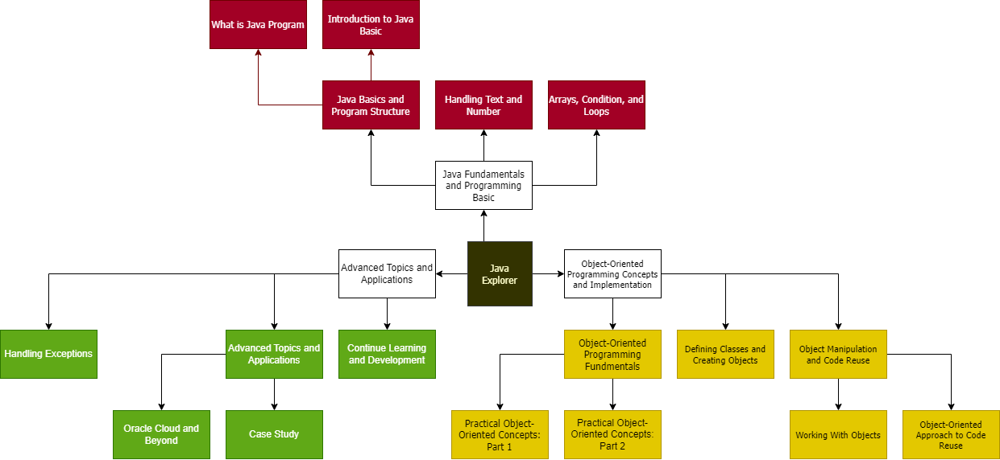

# Java Explorer (by Oracle University)

My Journey to Learn Java on Oracle University
Learn Java programming basics such as variables, classes, objects, loops, arrays, and decision constructs. Get introduced to Java's object-oriented capabilities. Learn how to play with Java using the NetBeans IDE, as well as the Oracle Cloud. Go ahead and Earn the Explorer Badge!

## This learning path provides an introduction to Java for

- Developers
- Designers, Administrators, and Architects
- Support and QA Engineers

## Coverage

- An Overview of Java
- Text and Numbers in Java
- Arrays, Conditions, and Loops
- Classes and Objects
- Exception Handling
- Inheritance and Interfaces
- Java on OCI

## Progress

- [ ] [Section A - Overview](JavaExplorer/SectionA)
- [ ] [Section B - Introduction to Java Basics](JavaExplorer/SectionB)
- [ ] [Section C - Practical Object-Oriented Concepts: Part 1](JavaExplorer/SectionC)
- [ ] [Section D - Practical Object-Oriented Concepts: Part 2](JavaExplorer/SectionD)
- [ ] [Section E - What is a Java Program](JavaExplorer/SectionE)
- [ ] [Section F - Handling Text and Numbers](JavaExplorer/SectionF)
- [ ] [Section G - Arrays, Conditions, and Loops](JavaExplorer/SectionG)
- [ ] [Section H - Defining Classes and Creating Objects](JavaExplorer/SectionH)
- [ ] [Section I - Working with Objects](JavaExplorer/SectionI)
- [ ] [Section J - Handling Exceptions](JavaExplorer/SectionJ)
- [ ] [Section K - Object-Oriented Approach to Code Reuse](JavaExplorer/SectionK)
- [ ] [Section L - Oracle Cloud and Beyond](JavaExplorer/SectionL)
- [ ] [Section M - Case Study](JavaExplorer/SectionM)
- [ ] [Section N - Continue Your Learning as a Java Programmer](JavaExplorer/SectionN)

## Instructor

[Joe Greenwald](https://www.linkedin.com/in/joe-greenwald-8626111/)
